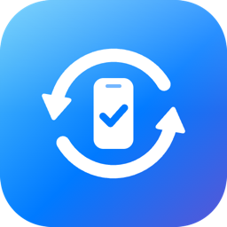
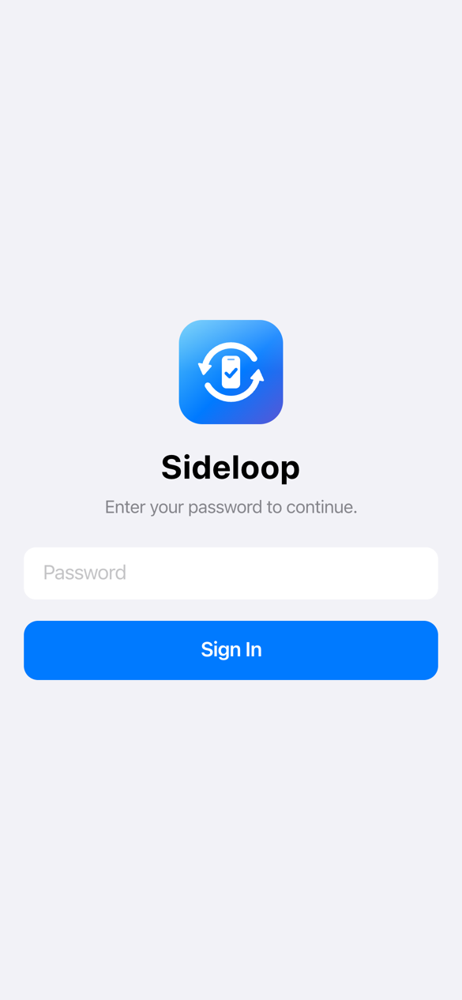
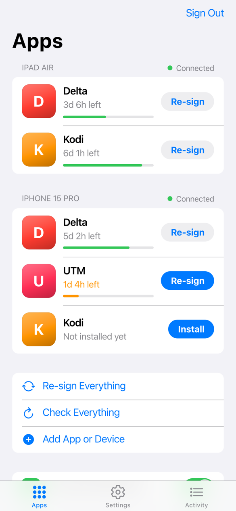
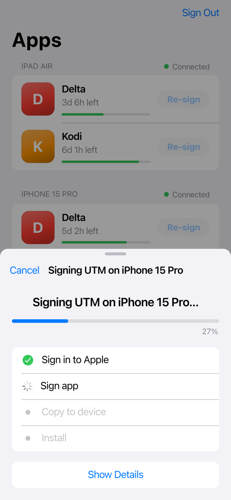
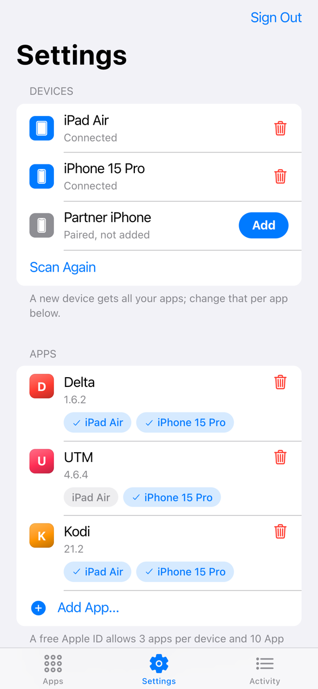
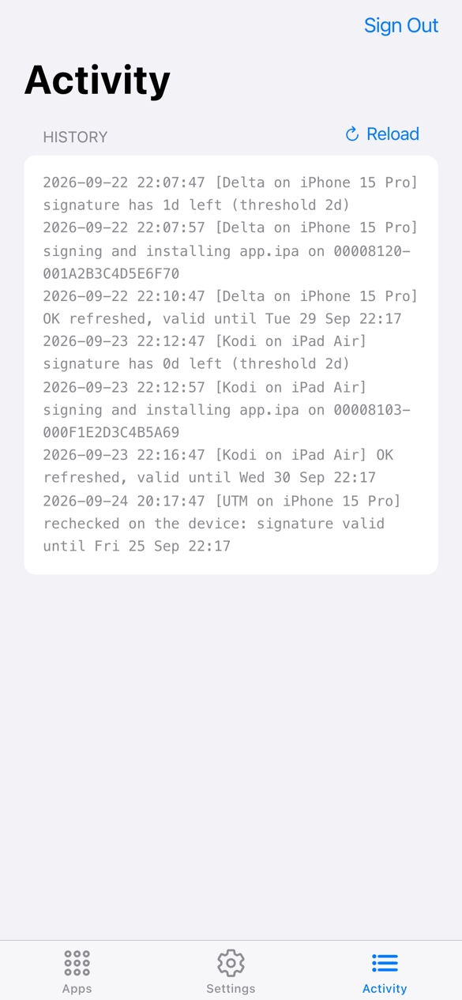

<div align="center">
  <a href="https://github.com/filippofinke/sideloop">
    
  </a>
  <h3 align="center">Sideloop</h3>
</div>

> Keep sideloaded IPAs signed with a free Apple ID, re-installed over Wi-Fi before the 7-day signature expires.

A small self-hosted service with a web UI for any Linux machine (amd64 or arm64) or a Mac. It re-signs your apps with [AltServer-Linux](https://github.com/jaakkopalvaila/AltServer-Linux) and installs them in place, so app data is kept. You don't need AltStore or SideStore on the device.

## Features

- [x] Multiple apps on multiple iPhones and iPads
- [x] Automatic re-signing when a device comes online, before the signature expires
- [x] Web UI for pairing, uploading IPAs, 2FA codes and live progress
- [x] Checks each IPA for FairPlay encryption, tweaks and app extensions
- [x] Self-hosted Apple sign-in via [anisette-v3-server](https://github.com/Dadoum/anisette-v3-server)
- [x] Python standard library only, one Docker image for amd64 and arm64

## Screenshots

| Login | Apps | Signing | Settings | Activity |
| :---: | :---: | :---: | :---: | :---: |
|  |  |  |  |  |

## Quick Start

Prerequisites

- Docker with Compose
- A throwaway Apple ID

Run on Linux

```bash
git clone https://github.com/filippofinke/sideloop.git
cd sideloop
cp .env.example .env
docker compose up -d
```

Open `http://<host>:8080` and set a password. Then pair a device over USB, add an IPA and enter your Apple ID.

Run on macOS

Docker on macOS can't see USB or Wi-Fi devices, so bridge the system usbmuxd first:

```bash
socat TCP-LISTEN:27015,bind=127.0.0.1,reuseaddr,fork UNIX-CONNECT:/var/run/usbmuxd &
docker compose -f docker-compose.yml -f docker-compose.mac.yml up -d
```

Pair the device in Finder and enable **Show this iPhone when on Wi-Fi**.

## Notes

- Use the Apple ID's **regular password**. App-specific passwords don't work.
- Apple asks for a **2FA code** on the first sign-in. After that, sign-ins are silent.
- The device must be **unlocked and on the same Wi-Fi** while a re-sign runs.
- A free account allows 3 apps per device and 10 App IDs per week. Each app extension needs its own App ID.
- If Apple sign-in stops working, update `ALTSERVER_TAG` in the `Dockerfile`.

Data is stored in `./data`.

## Author

👤 **Filippo Finke**

- Website: [https://filippofinke.ch](https://filippofinke.ch)
- Twitter: [@filippofinke](https://twitter.com/filippofinke)
- GitHub: [@filippofinke](https://github.com/filippofinke)
- LinkedIn: [@filippofinke](https://linkedin.com/in/filippofinke)

## Show your support

Give a ⭐️ if this project helped you!

<a href="https://www.buymeacoffee.com/filippofinke">
  
</a>

## 📝 License

Copyright © 2026 [Filippo Finke](https://github.com/filippofinke).<br />
This project is [MIT](./LICENSE) licensed. Icons from [Ionicons](https://ionic.io/ionicons) (MIT).

***

_Not affiliated with Apple. Use a throwaway Apple ID._
